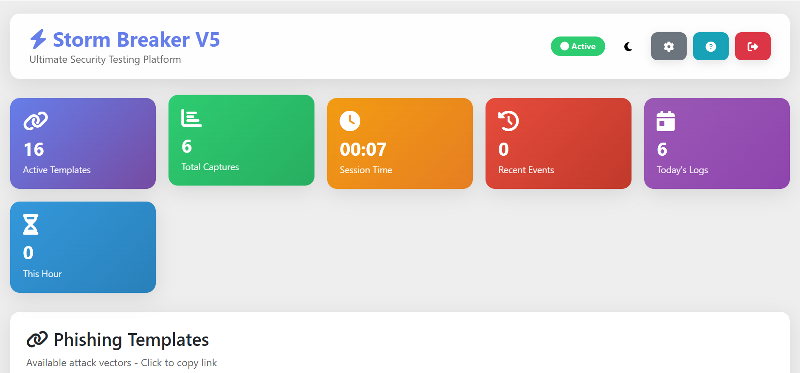

<h1 align="center">
  <br>
  <a href="https://github.com/ultrasecurity/Storm-Breaker"></a>

</h1>

<h4 align="center">Storm Breaker V5 - Advanced Social Engineering Tool</h4>
<h5 align="center">Customized & Enhanced by Fairoz Faisal</h5>

<p align="center">

  <a href="http://python.org">
    
  </a>
  <a href="https://php.net">
    
  </a>

  <a href="https://en.wikipedia.org/wiki/Linux">
    
  </a>

</p>


### Features:

- 🎯 Obtain Device Information Without Any Permission!
- 📍 Advanced Location Tracking [SMARTPHONES]
- 📷 Access Webcam with Enhanced Capture
- 🎤 Access Microphone & Audio Recording
- 🔐 URL Encryption & Link Protection (V5 NEW)
- 📱 Device Fingerprinting & Advanced Analytics
- 🎨 Multiple Professional Templates (Discord, Facebook, Google, Netflix, etc.)
- 📊 Real-time Control Panel with Enhanced UI
- 🖼️ Image Gallery Management
- 🔄 Template Selector & Link Generator

<br>

### Update Log:

#### Version 5 (V5) - Latest Update - November 2025
**Customized & Enhanced by Fairoz Faisal**

- 🚀 **Complete V5 Overhaul** - Advanced panel interface (panel-v5.php)
- 🔐 **URL Encryption System** - Secure link generation with encryption
- 🎨 **Enhanced UI/UX** - Modern colored themes and light themes
- 📱 **Advanced Features** - Device fingerprinting and advanced location tracking
- 🖼️ **Gallery Management** - Image upload, view, and delete capabilities
- 🔗 **Smart Link Generator** - Generate encrypted phishing links easily
- 📊 **Template Selector** - Choose from multiple professional templates
- 🎯 **Improved Templates** - Discord, Facebook, Google, Microsoft, Netflix, Spotify, Steam, Twitter, Weather, and more
- 💾 **Enhanced Logging** - Better log management and download options
- 🎵 **Audio Recording** - Microphone access with sound file management
- ⚡ **Performance Optimized** - Faster loading and improved stability
- 🛡️ **Security Enhancements** - Better encryption and data protection

#### Previous Updates:
- Second Update on November 4th, 2022
- Web panel structure implemented
- Auto-download Ngrok Added
- Templates optimized
- Personal host support

> We have deleted Ngrok in the new version of Storm breaker and entrusted the user with running and sharing the localhost . So please note that Storm breaker runs a localhost for you and you have to start the Ngrok on your intended port yourself .
> <br>

#### Attention! :

> This version can be run on both local host and your personal domain and host . However , you can use it for both situations. If your country has suspended the Ngrok service, or your country's banned Ngrok, or your victim can't open the Ngrok link (for the reasons such as : He sees such a link as suspicious, Or if this service is suspended in his country) We suggest using the tool on your personal host and domain .
> <br>

## Default username and password:

- `username` : `admin`
- `password` : `admin`
- You can edit the config.php file to change the username and password .
  <br>

### Dependencies

**`Storm Breaker`** requires following programs to run properly -

- `php`
- `python3`
- `git`
- `Ngrok`

<!--  -->
<br>

### Platforms Tested

- Kali Linux 2022
- macOS Big Sur / M1
- Termux (android)
- Personal host (direct admin and cPanel)
  <br>

### Installation On Kali Linux

```bash
git clone https://github.com/Fairoz007/Storm-Breaker-v5
cd Storm-Breaker-v5
sudo bash install.sh
sudo python3 -m pip install -r requirements.txt
sudo python3 st.py
```

### Quick Start V5

1. Run the tool: `sudo python3 st.py`
2. Access the panel at: `http://localhost:[PORT]`
3. Login with default credentials (admin/admin)
4. Use **panel-v5.php** for the latest features
5. Generate encrypted links using the Link Generator
6. Choose templates and share with targets
7. Monitor results in real-time

<br>

**`how to run personal host 👇`**

> Zip the contents of the storm-web folder completely and upload it to the public_html path .

> Note that the tool should not be opened in a path like this > yourdomain.com/st-web
> Instead , it should be opened purely in the public_html path (i.e. : don't just zip the storm-web folder itself, but manually zip its contents (the index.php file and other belongings should be in the public_html path)

#### Attention!:

> Note that to use this tool on your Localhost , You also need SSL . Because many of the tool's capabilities require SSL .

#### Attention!:

> To run ngrok on termux you need to enable your personal hotspot and cellular network.

</p>
